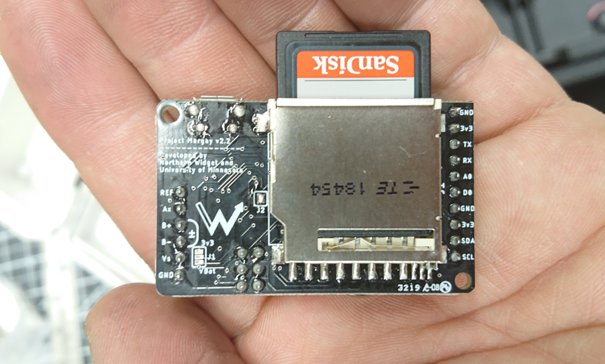
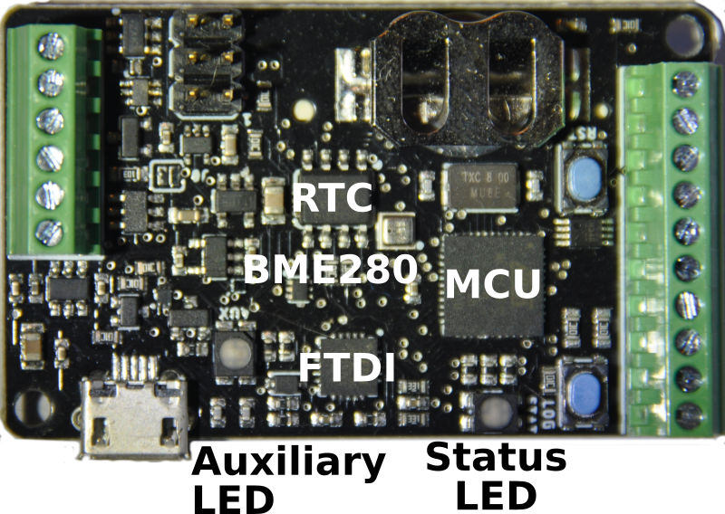
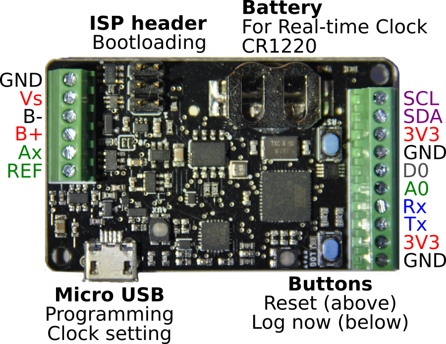
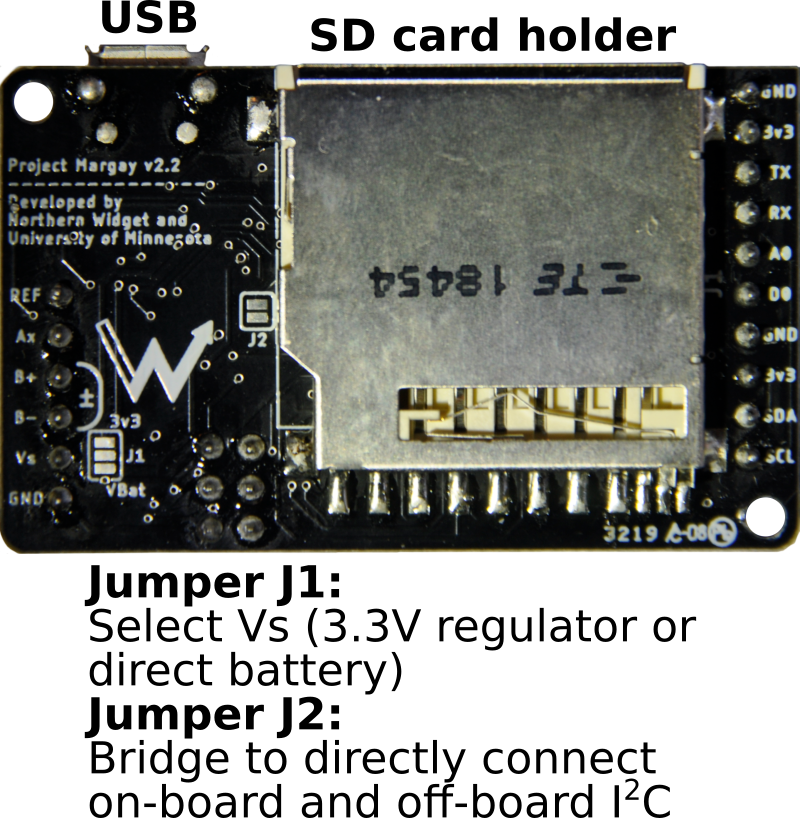

# Project-Margay
Project Margay is a micro scale environmental data logger designed based on the ALog series, it is designed to trade IO capabilities for cost and size, allowing for a very simple, but very useful data logger

***Margay data logger v2.2.*** *Back side with full-size SD card holder and pinout labels. Standard sized SD card for data storage and scale.*

# Hardware
This includes a description of the PCB and component functionality

## Features:
* ATMega644P Processor
* 3.3v Logic
* On board full size SD card (for ease of field use)
* Extremely low sleep current
* Input voltage designed for use with easy to find alkaline batteries
* 0.1" Pitch headers can be populated with header pins and placed on a breadboard for prototyping

***Significant components on the Margay v2.2.***

### v0.0 (Retired)
**Features**  
IQ = 1.6mA  
Iout = 50mA, max (Regulated power supplied to sensors)  
Vin = 3.3 ~ 5.5v  

**IO**:
* 1 I2C Bus
* 1 SPI Bus, with up to 2 CS pins
* 1 PWM Channel (output configurable to 3.3v or VBat via a jumper on bottom of board)
* RGB Status LED
* Auxiliary LED
* Reset Button
* Reconfigurable Button

### v1.0
**Features**  
IQ = 2.5&mu;A  
Iout = 50mA, max (Regulated power supplied to sensors)  
Vin = 3.3 ~ 5.5v (Reverse polarity protected)  

**IO**
* 1 ADC, 18 bit
* 1 I2C Bus
* 1 SPI Bus, with up to 2 CS pins
* 1 PWM Channel (output configurable to 3.3v or VBat via a jumper on bottom of board)
* RGB Status LED
* Auxiliary LED
* Reset Button
* Reconfigurable Button

### v2.0 (In development)
**Features**  
IQ = <2.5&mu;A (Estimated)  
Iout = 200mA, max (Regulated power supplied to sensors)  
Vin = 3.3 ~ 5.5v (Reverse polarity protected)  

**IO**
* 1 ADC, 18 bit
* 1 I2C Bus
* 1 UART Channel
* 2 GPIO Pins (one configurable as an 8 bit ADC)
* 1 PWM Channel (output configurable to 3.3v or VBat via a jumper on bottom of board)
* RGB Status LED
* Auxiliary LED
* Reset Button
* Reconfigurable Button

### Pinout:
Pinout is listed on bottom of board, and shown here for v2.2.

***Margay data logger, top annotated.***
* Positive voltage: red
* Ground: black
* Analog measurement system: green
* I2C bus: purple
* Digital I/O: gray
* UART (also called USART) bus: blue

*The jumper on the front of the board, to the right of "B+" and "Ax", connects an on-board reference resistor (10 kOhm in our builds) with the analog pin Ax to create a voltage divider in which the sensor between Ax and REF is on the GND side of the voltage divider.*

***Margay data logger, bottom annotated.*** This is where the labels for the above pins are printed.

In this pinout, the name of each pin is shown, as well as the group of pins which it belongs to, a detailed description of the pins and callouts follows:

#### Pins:
* 3v3, the switched 3.3v output rail, this rail can be turned on and off to disconnect power consumptive external devices
* GND, the main output ground
* BAT+, the positive connection for the battery line, voltage range 3.3v ~ 5.5v
* BAT-, Negative battery connection, this pin is NOT interchangeable with GND, as BAT- is reverse voltage protected to prevent damage from plugging the battery in backwards
* Vs, this is the switched PWM output, the voltage of this output is determined by a solder jumper on the bottom of the board, controlled by **D3**

* MOSI, this is the master out, slave in, pin for the SPI bus, which doubles as **D5** when SPI and SD card are not used
* MISO, this is the master in, slave out, pin for the SPI bus, which doubles as **D6** when SPI and SD card are not used
* SCK, this is the clock line for the SPI bus, which doubles as **D7** when SPI and SD card are not used
* CS, this is the chip select pin for the SPI bus, which doubles as both **D11** and **INT1** when external SPI is not used (Can be used even when SD card is used)

* SCL, this is the dedicated serial clock line for the I2C bus
* SDA, this is the dedicated serial data line for the I2C bus

#### Callouts:
1. This is the auxiliary LED, which indicate TX and RX status using red and blue channels, green channel is controlled by **D19**
2. This is the micro USB connection, which can be used for both programing via the Arduino IDE, and serial monitoring
3. This is the primary RGB status LED, where the individual channels are controlled by **D15**, **D14**, and **D13**
4. This is the reconfigurable push-button, generally used to initiate logging, it is read by **D2**, which is also **INT2**
5. This is the hardware reset button, which will force the micro to return to the initial state after code upload
6. This is the ICSP header, which can be used to burn the bootloader to the board or write programs to the chip without using the USB and bootloader

### Onboard Pins:
Pin Name | Pin Number (v0.0) | Pin Number (v1.0) | Function
-------- | ----------------- | ----------------- | --------
`SD_CS` | D4 | D4 | Chip select pin on SD card
`SD_CD` | D1 | D1 | Card detection pin for SD card, active low, AUX power must be on to use
`BuiltInLED` | D19 | D20 | Connected to green channel on **AUX** LED, on when pin is low
`RedLED` | D13 | D13 | Connected to red channel on **STAT** LED, on when pin is low
`GreenLED` | D15 | D15 | Connected to green channel on **STAT** LED, on when pin is low
`BlueLED` | D14 | D14 | Connected to blue channel on **STAT** LED, on when pin is low
`VRef_Pin` | A2 | A2 | Analog pin to read 1.8v on board reference, AUX power must be on to use
`ThermSensePin` | A1 | A1 | Analog pin to read thermistor voltage divider, AUX power must be on to use
`BatSensePin` | A0 | A0 | Analog pin to read battery voltage divider, AUX power must be on to use
`VSwitch_Pin` | D3 | D3 | Connected to MOSFET driver for **Vs** pin, active low
`Ext3v3Ctrl` | D12 | D19 | Turns on AUX power, active low
`I2C_SW` | N/A | D12 | Switches between on board I2C and external I2C
`PG` | D18 | D18 | Power good pin from core 3v3, can be used to test if core 3v3 is stable, pulled low when power is not stable
`ExtInt` | D11 | D11 | External interrupt and external chip select pin
`RTCInt` | D10 | D10 | Interrupt (`INT0`) connected to RTC /INT line, active low
`LogInt` | D2 | D2 | Interrupt (`INT2`) connected to **LOG** button, active low

# Software

## Using Northern Widget Software
This includes a usage guide to demo software which is provided to both test the hardware features of the board in general (the MargayHardwareTest file), and to set the device up as a logger using a [TP-Downhole](https://github.com/NorthernWidget/TP-DownHole) device as a sensor which runs on I2C. This logger demo tests all hardware on the board and ensures all required systems are connected and indicates the result of these tests using the Status LED on startup. A green light indicated all systems check out, and the device is ready to log, otherwise a red light indicates there is a problem, it is recommended to open up a serial monitor to determine which system is failing. If a green light is indicated, when the system is ready to log, logging is initiated by pressing the log button, which makes an initial log and starts a sequence of logs which will continue to occur every 15 minutes (by default) of by a different user defined time. In between logging events, the system is put to sleep to save power. Each time the log button is pressed, a new SD card file is created named "Logx.txt" where x increments with each button press, and each one of these individual files is initiated with a header to inform the user of the data columns used by the CSV type file.

To use this software the following libraries must be installed in the Arduino IDE:
* [SdFat](https://github.com/greiman/SdFat)
* [DS3231_Logger](https://github.com/NorthernWidget/DS3231_Logger)
* [MCP3421](https://github.com/NorthernWidget/MCP3421)
* [MS5803](https://github.com/NorthernWidget/MS5803)

Information on library instillation can be found on the [Arduino](https://www.arduino.cc/en/Guide/Libraries) site, the "Manual" instillation method should be used to ensure success

The Northern Widget board definitions will also be required, the Margay board should be run using the "TLog v1" board definition. Information on how to install and select a board definition can be found in the Northern Widget Board Definitions [readme](https://github.com/NorthernWidget/Arduino_Boards)

## Using Custom Software (Developer)
As we provide all information about on board pins and their functionality, it is easy for a user to write their own code in the Arduino IDE to leverage the hardware capabilities of the Margay to whatever degree is desired. To do this, the Northern Widget board file can be used (as described above), or the **[MightyCore](https://github.com/MCUdude/MightyCore)** Board files can be used. These are the board files the Northern Widget ones were based on, but allow for more compilation options for the user. Full instructions for instillation and use are provided on the MightyCore GitHub page.

For the Margay (any model), the recommended settings are as follows:

Setting | Value
--------|------
`Board` | `ATmega644`
`Pinout` | `Standard`
`Clock` | `8MHz External`
`Compiler LTO` | `Disabled`
`Variant` | `644P/644PA`
`BOD` | `2.7v`

# Developer Notes

+ (**<= Mrk 1.0**) When using power from the external rail (the 3v3 on the screw terminals) it is always advised to have a battery connected to the board, even if connected via USB. The USB connection is able to power the core components, but not the external rail. We know this is annoying, but fear not, the Northern Widget team is [working tirelessly](https://i.imgur.com/Kx97N0l.gifv) to fix this for the Mrk 2.0!
+ (**<= Mrk 1.0**) When using I2C on the device, external pullups (4.7k&Omega; ~ 10k&Omega;) are required. If using device strictly onboard the internal pullups on the ATMEGA seem sufficient, but if you add capacitance of a cable attaching to an external sensor, etc, this is often too much, since the internal pullups are very weak. This is also being fixed in the Mrk 2.0 version with dedicated switchable on board pullups.
+ (**All models**) The external power rails and the switched battery rail should be enabled in hardware by default, however, it is our recommendation to explicitly define these pins (`Ext3v3Ctrl`) as outputs and drive them `LOW` even if you never intend to switch them on and off. This prevents the rails from inadvertently being turned off due to a transient on the floating control line.

 
 This work is licensed under a <a rel="license" href="http://creativecommons.org/licenses/by-sa/4.0/">Creative Commons Attribution-ShareAlike 4.0 International License</a>.
